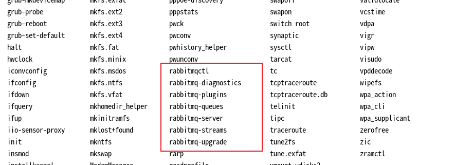

# RabbitMQ(3.13)

## Installing

### Debian

1. 安装Erlang

   3.13版本的rabbitmq需要erlang的最低版本为26.0,最高版本为26.2.x

   更详细的信息见：https://www.rabbitmq.com/docs/which-erlang#eol-series

​	**注意**：

​		1.Erlang 27（2024年5月发布）目前没有任何可用的RabbitMQ版本支持。在Erlang 27上运行			RabbitMQ时会出现显著的性能下降。

​		2.从 Erlang 26 开始，TLS 客户端对等方验证在 TLS 实现中默认启用。如果未配置客户端 TLS 证书			和密钥对，则启用 TLS 的 Shovels、Federation 链接和 LDAP 服务器连接将会失败。如果不需要对			等方验证，可以将其禁用。

 2.  安装rabbitmq(脚本安装,以root权限运行)

     ~~~ shell
     #!/bin/sh
     
     sudo apt-get install curl gnupg apt-transport-https -y
     
     ## Team RabbitMQ's main signing key
     curl -1sLf "https://keys.openpgp.org/vks/v1/by-fingerprint/0A9AF2115F4687BD29803A206B73A36E6026DFCA" | sudo gpg --dearmor | sudo tee /usr/share/keyrings/com.rabbitmq.team.gpg > /dev/null
     ## Community mirror of Cloudsmith: modern Erlang repository
     curl -1sLf https://github.com/rabbitmq/signing-keys/releases/download/3.0/cloudsmith.rabbitmq-erlang.E495BB49CC4BBE5B.key | sudo gpg --dearmor | sudo tee /usr/share/keyrings/rabbitmq.E495BB49CC4BBE5B.gpg > /dev/null
     ## Community mirror of Cloudsmith: RabbitMQ repository
     curl -1sLf https://github.com/rabbitmq/signing-keys/releases/download/3.0/cloudsmith.rabbitmq-server.9F4587F226208342.key | sudo gpg --dearmor | sudo tee /usr/share/keyrings/rabbitmq.9F4587F226208342.gpg > /dev/null
     
     ## Add apt repositories maintained by Team RabbitMQ
     sudo tee /etc/apt/sources.list.d/rabbitmq.list <<EOF
     ## Provides modern Erlang/OTP releases
     ##
     deb [arch=amd64 signed-by=/usr/share/keyrings/rabbitmq.E495BB49CC4BBE5B.gpg] https://ppa1.rabbitmq.com/rabbitmq/rabbitmq-erlang/deb/debian bookworm main
     deb-src [signed-by=/usr/share/keyrings/rabbitmq.E495BB49CC4BBE5B.gpg] https://ppa1.rabbitmq.com/rabbitmq/rabbitmq-erlang/deb/debian bookworm main
     
     # another mirror for redundancy
     deb [arch=amd64 signed-by=/usr/share/keyrings/rabbitmq.E495BB49CC4BBE5B.gpg] https://ppa2.rabbitmq.com/rabbitmq/rabbitmq-erlang/deb/debian bookworm main
     deb-src [signed-by=/usr/share/keyrings/rabbitmq.E495BB49CC4BBE5B.gpg] https://ppa2.rabbitmq.com/rabbitmq/rabbitmq-erlang/deb/debian bookworm main
     
     ## Provides RabbitMQ
     ##
     deb [arch=amd64 signed-by=/usr/share/keyrings/rabbitmq.9F4587F226208342.gpg] https://ppa1.rabbitmq.com/rabbitmq/rabbitmq-server/deb/debian bookworm main
     deb-src [signed-by=/usr/share/keyrings/rabbitmq.9F4587F226208342.gpg] https://ppa1.rabbitmq.com/rabbitmq/rabbitmq-server/deb/debian bookworm main
     
     # another mirror for redundancy
     deb [arch=amd64 signed-by=/usr/share/keyrings/rabbitmq.9F4587F226208342.gpg] https://ppa2.rabbitmq.com/rabbitmq/rabbitmq-server/deb/debian bookworm main
     deb-src [signed-by=/usr/share/keyrings/rabbitmq.9F4587F226208342.gpg] https://ppa2.rabbitmq.com/rabbitmq/rabbitmq-server/deb/debian bookworm main
     EOF
     
     ## Update package indices
     sudo apt-get update -y
     
     ## Install Erlang packages
     sudo apt-get install -y erlang-base \
                             erlang-asn1 erlang-crypto erlang-eldap erlang-ftp erlang-inets \
                             erlang-mnesia erlang-os-mon erlang-parsetools erlang-public-key \
                             erlang-runtime-tools erlang-snmp erlang-ssl \
                             erlang-syntax-tools erlang-tftp erlang-tools erlang-xmerl
     
     ## Install rabbitmq-server and its dependencies
     sudo apt-get install rabbitmq-server -y --fix-missing
     ~~~

 3.  运行rabbltmq(以root权限运行)

     ~~~ shell
     # stop the local node 停止
     sudo systemctl stop rabbitmq-server
     
     # start it back 启动
     sudo systemctl start rabbitmq-server
     
     # check on service status as observed by service manager 查看状态
     sudo systemctl status rabbitmq-server
     ~~~

 4.  Rabbitmq CLI Tools

     rabbitmq的工具除了rabbitmqadmin都在/sbin目录下

     需要先将这些工具信息添加到path变量中，方便在其他目录调用这些工具

     ~~~ shell
     export PATH=$PATH:/sbin
     ~~~

     

     

 5.  创建用户

     ~~~ shell
     rabbitmqctl add_user 'dejiangdexiaoming' '962021'
     ~~~

 6.  查看用户

     ~~~ shell
     root@debian12:/usr# rabbitmqctl list_users --formatter=json
     [
     {"user":"guest","tags":["administrator"]}
     ,{"user":"dejiangdexiaoming","tags":[]}
     
     ~~~

 7.  赋予用户权限

     ~~~ shell
     # First ".*" for configure permission on every entity
     # Second ".*" for write permission on every entity
     # Third ".*" for read permission on every entity
     root@debian12:/usr# rabbitmqctl set_permissions -p "/" "dejiangdexiaoming" ".*" ".*" ".*"
     Setting permissions for user "dejiangdexiaoming" in vhost "/" ...
     ~~~

     

 8.  日志

​	日志默认安装时存放位置为：/var/log/rabbitmq

## JAVA

RabbitMQ is a post box(邮箱), a post office（邮局）, and a letter carrier（快递员）.

- Producer:A program that sends messages 
- Queue:the name for the post box in RabbitMQ，mq当中邮箱的名称，队列本质上是一个大型的消息缓冲区
- Consumer: a program that mostly waits to receive messages

### Hello World

### Work Queues

每个消费者轮流消费队列里面的消息

### Publish/Subscribe

消息同时给所有消费者消费（扇出）

### Routing

### Topics

### RPC

### Publisher Confirms

## SPRING AMQP

